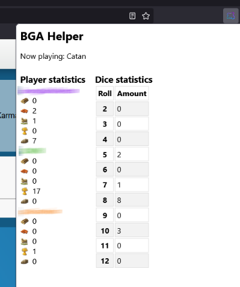

# Board Game Arena (BGA) Helper
A collection of helpful add-on's for Board Game Arena. Build from source or download from the official Mozilla addons page: 

## Catan Helper
The Catan helper **tracks the flow of resources**, so you can **see what resources the other players have during a given moment**. This is almost perfect, except for when an opponent steals from another opponent using the robber (though after a few rounds, this is usually corrected naturally). Dice roll statistics are also logged and displayed (so you can legitimately moan about your poor RNG ;-)).

## Coming soon
* **The crew** - card counting / advanced probability
* **Hanabi** - card counting / advanced probability

## Disclaimer
All of the information obtained and displayed in this extension can be manually obtained through the game logs.
